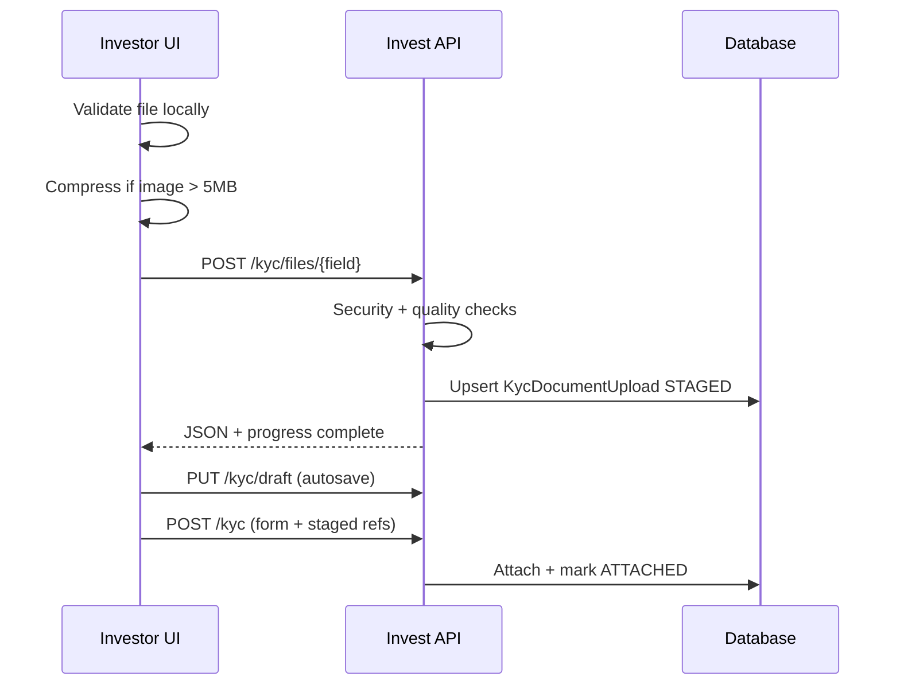

# Akshaya Investment — KYC Upload & Platform Audit Report

**Date:** 2026-06-01  
**Commit scope:** KYC upload production hardening (`a48b40c` baseline + this batch)

---

## 1. Executive summary

The KYC upload path was failing with generic “connection lost / request too large” errors because large multipart batches, synchronous OCR, and missing per-file upload UX caused timeouts. This release introduces **per-document staged uploads**, **database tracking**, **security validation**, **client compression**, and **draft resume**.

| Score | Value | Notes |
|-------|-------|-------|
| **Production readiness** | 78/100 | KYC upload hardened; full-platform items remain (see §6) |
| **Security** | 82/100 | Magic-byte checks, rate limits, scan hook; ClamAV optional |
| **Performance** | 75/100 | Parallel checks, OCR timeout, image compression |
| **Scalability** | 70/100 | In-memory rate limit; consider Redis for multi-node |

---

## 2. KYC issues found (before fix)

| ID | Severity | Issue |
|----|----------|-------|
| K1 | **Critical** | Full-form multipart submit → timeouts / `Failed to fetch` |
| K2 | **High** | No per-file validation before network |
| K3 | **High** | OCR re-processed existing files on every submit |
| K4 | **Medium** | No upload progress or retry |
| K5 | **Medium** | No DB tracking of upload status / failures |
| K6 | **Medium** | Duplicate file could be attached to multiple slots |
| K7 | **Low** | WebP/GIF allowed though product spec is JPG/PNG/PDF only |

---

## 3. Fixes implemented

### Frontend
- `KycDocumentField` — validate **before** upload, progress bar, auto-retry (3×), preview, replace/remove
- `kyc-upload.js` — SHA-256 duplicate detection, JPEG compression for images **> 5 MB**
- `KycPanel` — staged uploads map, draft autosave (`PUT /kyc/draft`), review step blocker list
- Strict types: JPG, JPEG, PNG, PDF only

### Backend
- `POST /api/invest/kyc/files/:fieldKey` — single-file multipart, rate limited
- `GET/DELETE /kyc/files`, `GET/PUT /kyc/draft`
- `KycDocumentUpload` model — status, path, SHA-256, scan result, fail reason
- `kycUploadSecurity.js` — magic bytes, blocked executables, structured logs
- Server limit **15 MB/file**; client enforces **10 MB**
- Final `POST /kyc` merges staged files; marks uploads `ATTACHED`

### Server (Nginx)
- `client_max_body_size 100m`
- `client_body_timeout 300s`, `proxy_read_timeout 300s`
- Gzip enabled (existing)

### Database
- `KycDocumentUpload` table
- `Kyc.draftStep`, `draftFormJson`, `uploadStatus`

### Tests
- `server/tests/kyc-upload-security.test.mjs` — field keys, blocked ext, basics

---

## 4. Security controls

| Control | Status |
|---------|--------|
| MIME + extension allowlist | ✅ |
| Magic-byte verification | ✅ |
| Executable extension blocklist | ✅ |
| Per-investor upload rate limit | ✅ (in-memory) |
| Virus scan hook (`KYC_VIRUS_SCAN_CMD`) | ✅ optional |
| Unique stored filenames | ✅ |
| Auth on all upload routes | ✅ |

---

## 5. KYC flow (after fix)



---

## 6. Remaining recommendations (platform-wide)

Not fully implemented in this pass (prioritize next sprints):

- **Resumable/chunked uploads** (tus.io) for very poor networks
- **Redis-backed rate limiting** for multi-instance API
- **ClamAV** on VPS (`KYC_VIRUS_SCAN_CMD`)
- **E2E Playwright** KYC upload path
- **Investment/withdrawal** race-condition audit (separate sprint)
- **CSP / security headers** global middleware
- **Centralized error tracking** (Sentry)

---

## 7. Deployment checklist

- [ ] `git pull` + `docker compose ... up -d --build`
- [ ] `nginx -t && systemctl reload nginx` (100M body limit)
- [ ] Confirm `db push` applied (`KycDocumentUpload` table)
- [ ] Hard refresh invest portal (Ctrl+F5)
- [ ] Test KYC: upload one doc → see progress → refresh page → file still staged
- [ ] Test submit with all required docs

---

## 8. Test commands

```bash
cd server && npm run test:kyc-upload
cd web && npm run build
```
